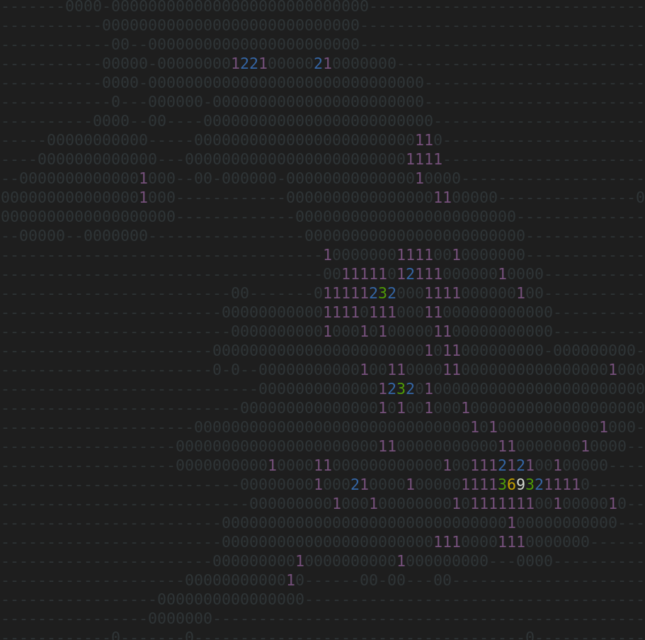

Quick challenge: 
given location of all cities in Czech Republic. I put all the cities on map, where each x,y(row, column) represent the count of cities based on their coordinates. 
- 1-9 where 9 is highest number of cities in x,y.
- - for no cities(have only gps coordinates of czech cities...)

